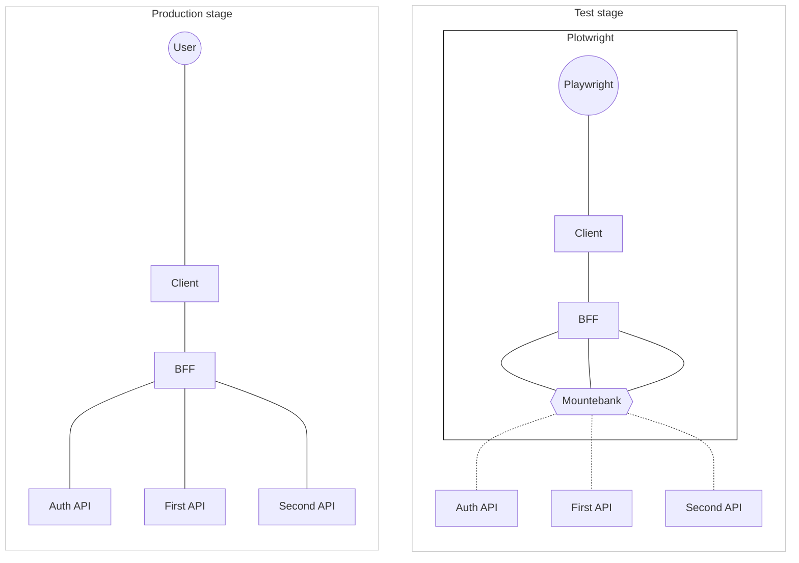

# Plotwright

Plotwright is a practical meta-framework for end-to-end testing, built on the basis of Mountebank and Playwright. Its main goal is to simplify the process of setting up, configuring, and running tests for developers, while providing a convenient and understandable API. Plotwright helps to create clean, readable, and easily maintainable tests.

The name "Plotwright" comes from the words "plot" (story) and "wright" (master). "Plot" here embodies the test scenario as a story or sequence of events, and "wright" represents the developer as a master creating these stories. Thus, Plotwright is a tool that helps developers "write scenarios" for their tests.

## Framework Idea

Plotwright provides a convenient wrapper around Playwright and Mountebank, allowing you to test the client part and BFF (Back-end for Front-end) of your application as a "black box". Instead of addressing real APIs, requests are redirected to Mountebank, which can provide predefined responses or proxy requests to real APIs. This simplifies testing, ensures test isolation, and eliminates network problems.

With Plotwright, you can test the client part and BFF of your application without worrying about their internal structure. Instead of testing interactions with real APIs, you can focus on testing contracts.

Here is a diagram that illustrates which parts of the product are covered by Plotwright tests:



On this diagram, it is shown how the client application and BFF interact with various APIs at the production stage and how Plotwright and Mountebank are used to test these interactions at the testing stage.

## Installation

To install Plotwright in your project, run the following command:

```bash
npm install --save-dev plotwright
```

## Configuration

Plotwright uses a configuration file to set various parameters. Here is an example of a configuration file:

```javascript
/**
 * @type {import('plotwright').Configuration}
 */
module.exports = {
  playwright: {
    testDir: "tests",
    fullyParallel: true,
    forbidOnly: !!process.env.CI,
    retries: process.env.CI ? 2 : 0,
    workers: process.env.CI ? 1 : undefined,
    reporter: "html",
    use: {
      baseURL: "http://127.0.0.1:3000",
      trace: "on-first-retry",
    },
    projects: [
      {
        name: "chromium",
        use: { ...devices["Desktop Chrome"] },
      },
    ],
    webServer: {
      command: "npm run start",
      url: "http://127.0.0.1:3000",
      reuseExistingServer: !process.env.CI,
    },
  },
  mountebank: {
    imposters: [
      {
        protocol: "http",
        port: 3000,
        stubs: [
          {
            responses: [
              {
                is: {
                  statusCode: 200,
                  headers: {
                    "Content-Type": "application/json",
                  },
                  body: JSON.stringify({ message: "Hello, World!" }),
                },
              },
            ],
          },
        ],
      },
    ],
  },
};
```

Test isolation in Plotwright is achieved by creating unique stubs for each test. All requests from each test are signed with a special X-Request-ID header with a unique identifier. The identifier can be set by the user using the `useAnnotation` function or it can use the internal identifier of Playwright itself.

```javascript
await useAnnotation("ID", "RP-TC-003");
```

Stubs are connected in the test using the `useStubs` function:

```javascript
await useStubs([
  import("./__stubs__/oauth.json"),
  import("./__stubs__/api.json"),
]);
```

Before the test is executed, the framework places the specified stubs in Mountebank, using the unique identifier as an additional condition in the `predicates` section of the stub.

When Mountebank receives a request, it finds the corresponding stub based on the specified conditions and the value of X-Request-ID.

For this mechanism to work correctly, it is necessary to ensure the transmission of the X-Request-ID header through your BFF and along with requests to the API. This will allow Mountebank to correctly identify and use the appropriate stubs.

## Writing Tests

Plotwright provides a convenient API for writing end-to-end tests. It is important to note that you should import test, describe, expect, and step from the plotwright package, as Plotwright extends these functions and provides additional capabilities. Here is an example of a test:

```javascript
import { test, describe, expect, step } from "plotwright";

describe("Test suite", () => {
  test("Test example page", async ({ page }) => {
    await page.goto("https://example.com");

    await step("Check page title", async () => {
      const title = await page.title();
      expect(title).toBe("Example Domain");
    });

    await step("Check page has button 'Submit'", async () => {
      await expect(page.getByRole("button", { name: "Submit" })).toBeVisible();
    });
  });
});
```

You can use any functions and classes from Playwright. Please refer to the [Playwright documentation](https://playwright.dev/) for additional information about available functions.

After writing the tests, you can run them using the command

```bash
npx plotwright test
```

### Support and Contribution to the Project

I am always glad to help the community in developing and improving Plotwright. If you have found a bug, want to suggest an improvement or add new functionality, please create an issue or pull request in the repository on GitHub.

If you have questions or suggestions for using Plotwright, you can also create an issue, and I will try to respond to it as soon as possible.

I thank you for your interest in Plotwright and appreciate your contribution to its development!
